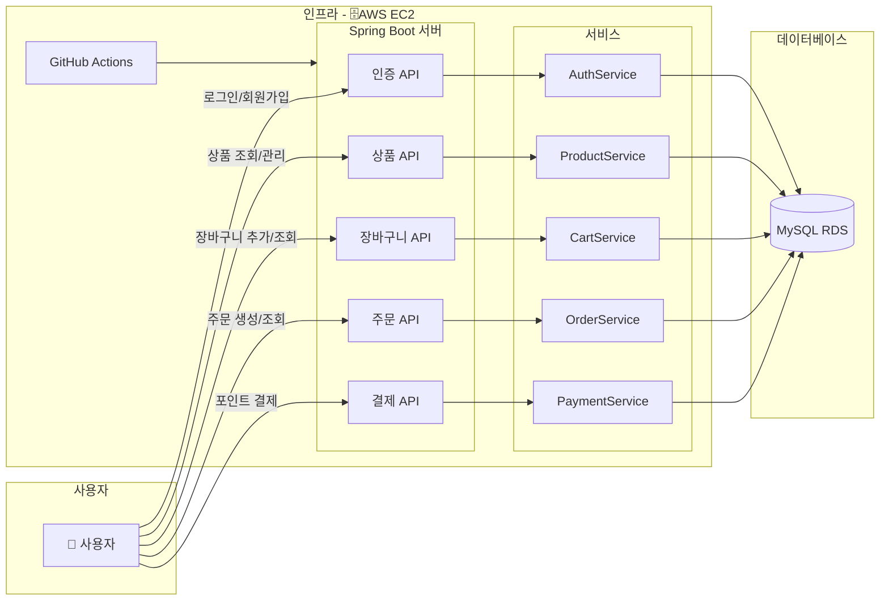

# 이커머스 API

## 1. 프로젝트 소개

상품 CRUD 기능으로 시작해 인증, 장바구니, 주문, 포인트 결제 등 이커머스 서비스에 필요한 기능을 구현했습니다. 

**동시성 이슈 해결, CI/CD 파이프라인 구축** 등을 진행하며 실제 이커머스 환경의 문제를 경험하기 위해 고민했습니다.

---

###  **API 문서**

- **[API 문서 (Swagger)](http://3.34.46.39:8081/swagger-ui/index.html)**

---

## 2. 주요 기능

- **상품 관리**: 상품을 등록, 수정, 삭제할 수 있는 기능을 구현했습니다.
- **사용자 인증**: JWT 기반의 회원가입 및 로그인 기능을 제공합니다.
- **장바구니**: 원하는 상품을 담고, 수량을 변경하고, 삭제하는 등의 장바구니 기능을 제공합니다.
- **주문 및 결제**: 장바구니의 상품으로 주문을 생성하고, 내부 포인트를 이용한 결제 기능을 구현했습니다.
- 
## 3. 적용 기술 및 개발 환경

- **Backend**: `Java`, `Spring Boot`, `Spring Security`, `Spring Data JPA`
- **Database**: `MySQL`
- **DevOps**: `GitHub Actions`, `AWS EC2`, `AWS RDS`
- - **Test**: `JUnit 5`, `Mockito`

## 4. API 명세

### **User API**

| 기능 | HTTP Method | URL | 설명 |
| :--- | :--- | :--- | :--- |
| 회원가입 | `POST` | `/api/users/signup` | 새로운 사용자 등록 |
| 로그인 | `POST` | `/api/users/login` | 이메일, 비밀번호로 로그인 후 JWT 발급 |

### **Product API**

| 기능 | HTTP Method | URL | 설명 |
| :--- | :--- | :--- | :--- |
| 상품 생성 | `POST` | `/api/products` | 새로운 상품 등록 (ADMIN 권한 필요) |
| 상품 상세 조회 | `GET` | `/api/products/{productId}` | 특정 상품의 상세 정보 조회 |
| 상품 목록 조회 | `GET` | `/api/products` | 모든 상품 목록 페이징 조회 |
| 상품 정보 수정 | `PUT` | `/api/products/{productId}` | 특정 상품의 정보 수정 (ADMIN 권한 필요) |
| 상품 삭제 | `DELETE` | `/api/products/{productId}` | 특정 상품 삭제 (ADMIN 권한 필요) |

### **Cart API**

| 기능 | HTTP Method | URL | 설명 |
| :--- | :--- | :--- | :--- |
| 장바구니 상품 추가 | `POST` | `/api/cart/items` | 내 장바구니에 상품 추가 |
| 내 장바구니 조회 | `GET` | `/api/cart` | 내 장바구니의 모든 상품 조회 |
| 장바구니 상품 수량 변경 | `PATCH` | `/api/cart/items/{cartItemId}` | 장바구니 내 특정 상품의 수량 변경 |
| 장바구니 상품 삭제 | `DELETE` | `/api/cart/items/{cartItemId}` | 장바구니에서 특정 상품 제거 |

### **Order API**

| 기능 | HTTP Method | URL | 설명 |
| :--- | :--- | :--- | :--- |
| 주문 생성 | `POST` | `/api/orders` | 장바구니의 모든 상품으로 새로운 주문 생성 |
| 내 주문 목록 조회 | `GET` | `/api/orders` | 내 모든 주문 내역 페이징 조회 |
| 주문 상세 조회 | `GET` | `/api/orders/{orderId}` | 내 특정 주문의 상세 내역 조회 |
| 주문 취소 | `POST` | `/api/orders/{orderId}/cancel` | 내 특정 주문 취소 |

### **Payment API**

| 기능 | HTTP Method | URL | 설명 |
| :--- | :--- | :--- | :--- |
| 내부 포인트 결제 | `POST` | `/api/payments/internal/{orderId}` | 내부 포인트를 사용한 주문 결제 처리 |

 

## 5. 테스트 가이드

- **테스트 계정 (ADMIN)**: `admin@admin.com` / `admin`
  - 테스트 관리자 계정입니다.
  - 상품 등록 등 관리자 전용 API를 테스트할 수 있습니다.

- **초기 데이터**: 
  - **상품**: `testProduct` (price: 1000, stock: 1000)가 기본으로 생성되어 있습니다.
  - **포인트**: 모든 사용자는 회원가입 시 **1,000,000 포인트**가 기본적으로 지급됩니다.

- **테스트 방법**:
  1.  `/api/users/login` API를 통해 로그인하고 `accessToken`을 발급받습니다.
  2.  인증이 필요한 API는 HTTP 요청 헤더에 `Authorization: Bearer {accessToken}`을 포함하여 호출합니다. (Swagger 사용 시 우측 상단의 **Authorize** 버튼을 눌러 <accessToken> 입력)
 
## 6. 전체 시스템 아키텍처

<b>아키텍처 확인</b>

 ## 7. 문제 해결 및 개선 경험

이 프로젝트를 진행하며 마주했던 주요 기술적 문제들과, 이를 해결하며 **'왜'** 라는 질문을 던지고 더 나은 방향을 고민했던 경험입니다.

#### 1. 객체지향 설계
- **문제점**: `OrderService`에서 주문을 생성할 때 상품의 재고를 직접 변경(`product.setStockQuantity()`)하는 코드를 작성했습니다. 이 방식은 재고 변경과 관련된 모든 책임이 `Service` 계층에 집중되어 만약 다른 서비스에서도 재고를 변경해야 할 경우 로직이 중복되고 일관성이 깨질 위험이 있었습니다. 이는 객체지향의 **캡슐화(Encapsulation)** 원칙에 위배된다고 판단했습니다.
- **해결 과정**: `Product` 엔티티 내부에 `removeStock(int quantity)`이라는 **재고를 감소시키는 책임**을 가진 메소드를 만들었습니다. 이 메소드는 재고가 충분한지 스스로 검증하고 부족할 경우 예외를 발생시키는 로직까지 포함합니다. `OrderService`는 이제 단순히 `product.removeStock(int quantity)`을 호출하여 도메인에 작업을 위임하기만 하면 됩니다.
- **결과**: `Product`와 관련된 핵심 비즈니스 로직(재고 관리)을 **해당 도메인 객체가 직접 책임**지도록 하여 코드의 응집도를 높이고 유지보수성을 향상시키는 객체지향적인 설계를 경험했습니다.

#### 2. 동시성 제어
- **문제점**: 여러 사용자가 동시에 주문을 요청하는 경우 재고를 확인하고 차감하는 로직이 동시에 실행되어 실제 재고보다 많은 주문이 처리되고 재고가 음수가 되는 문제가 발생할 수 있었습니다.
- **해결 과정**: 충돌이 빈번할 것으로 예상했기 때문에 데이터베이스 레벨에서 락(Lock)을 거는 **비관적 락(Pessimistic Lock)** 방식을 사용했습니다. `ProductRepository`에 `@Lock(LockModeType.PESSIMISTIC_WRITE)` 어노테이션을 적용한 조회 메소드를 추가했습니다.
- **결과**: 특정 상품의 재고를 변경하는 트랜잭션이 실행되는 동안, 다른 트랜잭션은 해당 상품의 레코드에 접근할 수 없게 됩니다. 이를 통해 **동시 요청 상황에 데이터의 정합성을 보장**했습니다.

#### 3. 데이터베이스
- **DTO를 통한 계층 분리**:
    - **문제점**: 엔티티 클래스를 API의 요청 및 응답 객체로 직접 사용하는 것의 위험성을 인지했습니다. 이 방식은 엔티티의 모든 필드가 외부에 그대로 노출될 수 있고, 엔티티의 내부 로직 변경이 API 스펙에 직접적인 영향을 주어 매우 불안정한 구조를 만들게 됩니다.
    - **해결 과정**: 이러한 문제를 해결하기 위해 각 API의 목적에 맞는 별도의 DTO를 설계했습니다. 예를 들어, 회원가입 시에는 `UserSignupRequestDto`를, 상품 조회 시에는 `ProductResponseDto`를 사용하여 클라이언트와 시스템 내부의 데이터 표현을 분리했습니다.
    - **결과**: 엔티티를 외부로부터 완벽하게 보호하고 API의 요청/응답 스펙을 안정적으로 유지할 수 있게 되었습니다. 또한, `@Valid`를 이용한 유효성 검증 로직을 DTO 계층에서 처리하게 되어 각 클래스가 자신의 책임에만 집중하는 코드를 작성했습니다.
- **트랜잭션을 통한 데이터 일관성 확보**:
    - **문제점**: 여러 데이터를 동시에 변경해야 하는 작업 중 하나라도 실패하면, 데이터의 무결성이 훼손되는 문제가 발생할 수 있습니다.
    - **해결 과정**: **`@Transactional`** 어노테이션을 서비스 계층에 적용하여 모든 DB 작업을 하나의 단위로 묶었습니다. 이를 통해 중간에 예외가 발생하면 이전에 처리된 모든 작업이 자동으로 롤백(Rollback)되어 **데이터의 일관성과 무결성을 보장**하도록 설계했습니다.

#### 4. 인프라 및 배포 자동화
- **CI/CD**: 개발 생산성을 극대화하고 'push-to-deploy' 환경을 구축하기 위해 **GitHub Actions**를 이용한 배포 자동화 파이프라인을 설계하고 구현했습니다.
- **민감 정보의 안전한 관리**: 하드코딩되어 있던 모든 민감 정보를 **GitHub Secrets** 로 완벽하게 분리하여 코드 저장소의 보안을 확보했습니다.
