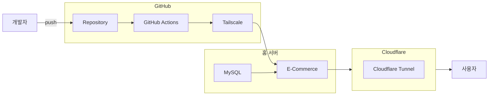

# 이커머스 API

## 1. 프로젝트 소개

상품 CRUD 기능으로 시작해 인증, 장바구니, 주문, 포인트 결제 등 이커머스 서비스에 필요한 기능을 구현했습니다. 

**동시성 이슈 해결, CI/CD 파이프라인 구축** 등을 진행하며 실제 이커머스 환경의 문제를 경험하기 위해 고민했습니다.

---

###  **API 문서**

- **[API 문서 (Swagger)](https://ecommerce.minjae5024.store/swagger-ui/index.html)**

---

## 2. 주요 기능

- **상품 관리**: 상품을 등록, 수정, 삭제할 수 있는 기능을 구현했습니다.
- **사용자 인증**: JWT 기반의 회원가입 및 로그인 기능을 제공합니다.
- **장바구니**: 원하는 상품을 담고, 수량을 변경하고, 삭제하는 등의 장바구니 기능을 제공합니다.
- **주문 및 결제**: 장바구니의 상품으로 주문을 생성하고, 내부 포인트를 이용한 결제 기능을 구현했습니다.
- 
## 3. 적용 기술 및 개발 환경

- **Backend**: `Java`, `Spring Boot`, `Spring Security`, `Spring Data JPA`
- **Database**: `MySQL`
- **DevOps**: `GitHub Actions`, ~~`AWS EC2`~~, ~~`AWS RDS`~~ -> 홈 서버로 마이그레이션 완료
- - **Test**: `JUnit 5`, `Mockito`

## 4. API 명세

### **User API**

| 기능 | HTTP Method | URL | 설명 |
| :--- | :--- | :--- | :--- |
| 회원가입 | `POST` | `/api/users/signup` | 새로운 사용자 등록 |
| 로그인 | `POST` | `/api/users/login` | 이메일, 비밀번호로 로그인 후 JWT 발급 |

### **Product API**

| 기능 | HTTP Method | URL | 설명 |
| :--- | :--- | :--- | :--- |
| 상품 생성 | `POST` | `/api/products` | 새로운 상품 등록 (ADMIN 권한 필요) |
| 상품 상세 조회 | `GET` | `/api/products/{productId}` | 특정 상품의 상세 정보 조회 |
| 상품 목록 조회 | `GET` | `/api/products` | 모든 상품 목록 페이징 조회 |
| 상품 정보 수정 | `PUT` | `/api/products/{productId}` | 특정 상품의 정보 수정 (ADMIN 권한 필요) |
| 상품 삭제 | `DELETE` | `/api/products/{productId}` | 특정 상품 삭제 (ADMIN 권한 필요) |

### **Cart API**

| 기능 | HTTP Method | URL | 설명 |
| :--- | :--- | :--- | :--- |
| 장바구니 상품 추가 | `POST` | `/api/cart/items` | 내 장바구니에 상품 추가 |
| 내 장바구니 조회 | `GET` | `/api/cart` | 내 장바구니의 모든 상품 조회 |
| 장바구니 상품 수량 변경 | `PATCH` | `/api/cart/items/{cartItemId}` | 장바구니 내 특정 상품의 수량 변경 |
| 장바구니 상품 삭제 | `DELETE` | `/api/cart/items/{cartItemId}` | 장바구니에서 특정 상품 제거 |

### **Order API**

| 기능 | HTTP Method | URL | 설명 |
| :--- | :--- | :--- | :--- |
| 주문 생성 | `POST` | `/api/orders` | 장바구니의 모든 상품으로 새로운 주문 생성 |
| 내 주문 목록 조회 | `GET` | `/api/orders` | 내 모든 주문 내역 페이징 조회 |
| 주문 상세 조회 | `GET` | `/api/orders/{orderId}` | 내 특정 주문의 상세 내역 조회 |
| 주문 취소 | `POST` | `/api/orders/{orderId}/cancel` | 내 특정 주문 취소 |

### **Payment API**

| 기능 | HTTP Method | URL | 설명 |
| :--- | :--- | :--- | :--- |
| 내부 포인트 결제 | `POST` | `/api/payments/internal/{orderId}` | 내부 포인트를 사용한 주문 결제 처리 |

 

## 5. 테스트 가이드

- **테스트 계정 (ADMIN)**: `admin@admin.com` / `admin`
  - 테스트 관리자 계정입니다.
  - 상품 등록 등 관리자 전용 API를 테스트할 수 있습니다.

- **초기 데이터**: 
  - **상품**: `testProduct` (price: 1000, stock: 1000)가 기본으로 생성되어 있습니다.
  - **포인트**: 모든 사용자는 회원가입 시 **1,000,000 포인트**가 기본적으로 지급됩니다.

- **테스트 방법**:
  1.  `/api/users/login` API를 통해 로그인하고 `accessToken`을 발급받습니다.
  2.  인증이 필요한 API는 HTTP 요청 헤더에 `Authorization: Bearer {accessToken}`을 포함하여 호출합니다. (Swagger 사용 시 우측 상단의 **Authorize** 버튼을 눌러 <accessToken> 입력)
 
## 6. 전체 시스템 아키텍처

<b>아키텍처 확인</b>

 ## 7. 문제 해결 및 개선 경험

- **동시성 이슈 해결**
    - 동시 주문 시 재고 데이터가 일치하지 않는 문제를 해결하기 위해 비관적 락(Pessimistic Lock)을 적용했습니다.

- **N+1 문제 해결 (Fetch Join 및 @EntityGraph)**
    - 연관 관계 매핑 시 발생하는 N+1 문제를 `@EntityGraph`를 사용해 해결했습니다.

- **CI/CD 파이프라인 구축**
    - GitHub Actions를 기반으로 빌드 → 테스트 → 배포 과정을 자동화하는 파이프라인을 구축했습니다.

- **민감정보 분리**
    - 각종 키, 계정 정보 등의 민감정보를 코드에서 분리해 GitHub Secrets로 관리하여 보안을 강화했습니다.
